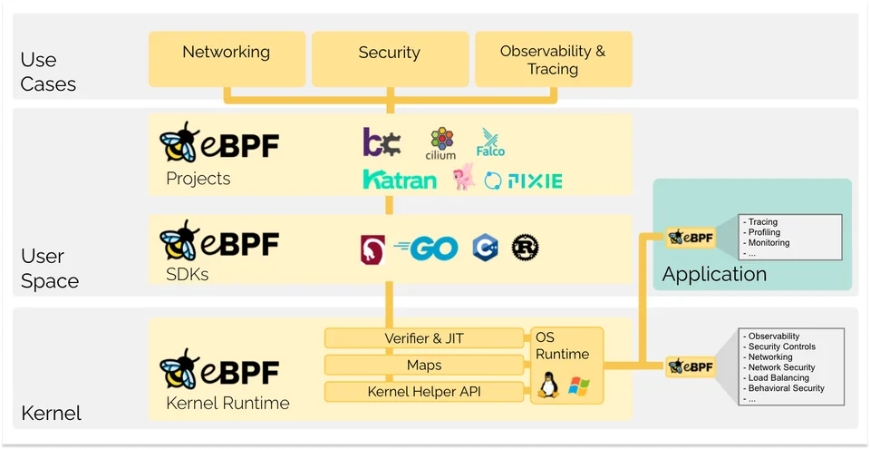

# eBPF Presentation Outline

## 1. Introduction to eBPF
- **What is eBPF?**
  - eBPF is a revolutionary technology with origins in the Linux kernel that can run sandboxed programs in a privileged context such as the operating system kernel. It is used to safely and   
    efficiently extend the capabilities of the kernel without requiring to change kernel source code or load kernel modules.
  - Use case & Architecture
  
  - 
  
- **Why eBPF?**
  - Advantages and unique features
  - Performance benefits
  - Flexibility and extensibility

## 2. eBPF Architecture
- **Components**
  - eBPF programs
  - eBPF maps
- **Lifecycle**
  - Writing eBPF programs
  - Compiling and loading eBPF programs
  - Attaching eBPF programs to hooks
  - Verifying eBPF programs (BPF verifier)
- **Execution Environment**
  - Kernel space vs user space
  - Interaction with the Linux kernel

## 3. eBPF Program Types
- **XDP (eXpress Data Path)**
  - Overview and use cases (e.g., DDoS protection, load balancing)
  - How XDP works
  - Demo: Simple XDP program
- **tc (Traffic Control)**
  - Overview and use cases (e.g., traffic shaping, QoS)
  - How tc works
  - Demo: Simple tc program
- **Tracing**
  - Overview and use cases (e.g., performance monitoring, debugging)
  - Tools: bpftrace, perf, and other tracing tools
  - Demo: Simple tracing program
- **Socket Filtering**
  - Overview and use cases (e.g., packet filtering)
  - How socket filtering works
- **kprobes and uprobes**
  - Overview and use cases (e.g., kernel and user-space function tracing)
  - How kprobes and uprobes work
- **cgroup/skb**
  - Overview and use cases (e.g., resource management, security policies)
  - How cgroup/skb works

## 4. eBPF Maps
- **Types of Maps**
  - Hash maps, arrays, LRU maps, etc.
- **Usage**
  - Storing state and data
  - Inter-process communication
  - Example usage in programs

## 5. Tools and Ecosystem
- **eBPF Tooling**
  - bpftool
  - iproute2
  - bcc (BPF Compiler Collection)
  - bpftrace
- **eBPF Development Workflow**
  - Writing and compiling eBPF programs
  - Loading and attaching programs
  - Monitoring and debugging

## 6. Demos
- **XDP Demo**
  - Write a simple XDP program
  - Compile and load the program
  - Attach the program to a network interface
  - Demonstrate packet filtering or load balancing
- **tc Demo**
  - Write a simple tc program
  - Compile and load the program
  - Attach the program to a traffic control hook
  - Demonstrate traffic shaping or QoS
- **Tracing Demo**
  - Write a simple tracing program using bpftrace
  - Run the program to trace system calls or kernel functions
  - Analyze the tracing output

## 7. Real-world Use Cases and Examples
- **Case Studies**
  - How companies use eBPF in production
  - Examples from networking, security, and observability
- **Best Practices**
  - Writing efficient eBPF programs
  - Avoiding common pitfalls

## 8. Future of eBPF
- **Ongoing Developments**
  - New features and enhancements
  - Integration with other technologies
- **Community and Ecosystem**
  - Open-source projects and contributions
  - Resources for learning and development

## 9. Q&A
- Open the floor for questions and discussion

---

### Presentation Tips
- **Visual Aids**: Use diagrams and flowcharts to explain concepts.
- **Code Examples**: Show snippets of code for each type of eBPF program.
- **Live Demos**: Perform live demos if possible to engage the audience.
- **Interactivity**: Encourage questions and interactions throughout the presentation.

---

### Resources for Further Reading
- **Documentation**
  - [eBPF documentation](https://ebpf.io/what-is-ebpf/)
  - [bcc documentation](https://github.com/iovisor/bcc)
  - [bpftrace documentation](https://github.com/iovisor/bpftrace)
- **Books**
  - "BPF Performance Tools" by Brendan Gregg
- **Online Tutorials and Courses**
  - Various online platforms offering courses on eBPF
